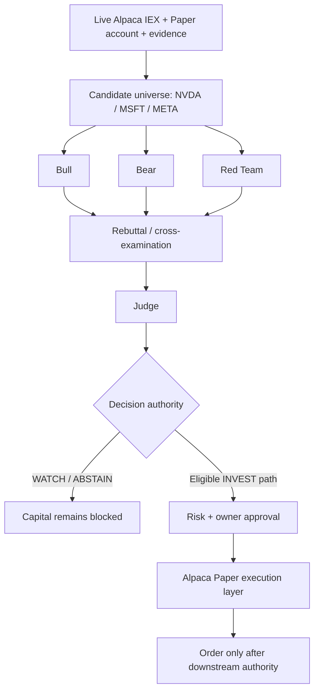

# Market Jury — AI Investment Council

> **An adversarial AI investment decision system connected to live Alpaca market data and an Alpaca Paper portfolio.**
>
> **Live demo:** https://market-jury-alpaca-2026.onrender.com/?symbol=NVDA

Market Jury is a working hackathon prototype built for the **Alpaca AI Trading Agents Hackathon 2026**. Instead of asking one model for a stock pick, it separates investment analysis into opposing roles — **Bull, Bear, Red Team, and Judge** — and keeps analysis authority separate from capital approval and broker execution.

The core principle is simple:

> **Buying power ≠ permission to trade.**

The public demo can observe live Alpaca IEX prices and a real Alpaca Paper account while keeping capital explicitly blocked and broker orders at zero.

---

## Try the live demo

Open **[Market Jury](https://market-jury-alpaca-2026.onrender.com/?symbol=NVDA)**.

A judge can understand the product in about one minute:

1. **Enter Live Demo** from the welcome screen.
2. Compare **NVDA, MSFT, and META** using live Alpaca IEX prices plus persisted market/fundamental evidence.
3. Open **Portfolio** to see live Alpaca Paper equity, cash, buying power, and open positions.
4. See the separation between **broker capacity** and **decision capital** — the account may have buying power while capital remains **NOT RELEASED**.
5. In the Market Jury panel, press **Freeze Initial Cost Preflight**. This performs read-only evidence capture, freezes the exact 9 Initial Council requests, hashes them, and calculates a worst-case model cost **before any paid model call**.
6. A verified public preflight produced **9 Initial calls** with a maximum cost of **$0.8285805**, followed by an explicit **Owner Approval Required** gate.
7. Open **Trades** and **History** to inspect the blocked execution path and decision lifecycle.

The public deployment is intentionally safety-first: **broker writes = 0, Alpaca orders = 0, live money = prohibited**.

---

## What problem does Market Jury solve?

A single AI investing agent can be confident, opaque, and difficult to challenge. It can also blur together four very different authorities:

- researching an investment,
- making a decision,
- allocating capital,
- placing a broker order.

Market Jury separates those concerns.

A bullish argument is challenged by a bearish argument. A Red Team attacks evidence quality and process integrity. A Judge adjudicates the competing views. Even after a decision exists, downstream capital and execution remain separate gates.

This makes the system easier to inspect, harder to over-trust, and safer to connect to brokerage infrastructure.

---

## Product flow



### Council topology

The intended real Council topology is:

- **Initial:** Bull + Bear + Red Team × 3 candidates = **9 calls**
- **Rebuttal:** 3 calls
- **Judge:** 1 call
- **Total:** **13 calls**

The public V6 demo currently exposes the exact **9-call Initial cost/approval gate** and a local zero-cost simulation for the Council interaction. A paid production model executor is **not enabled** in the public demo.

---

## What is working now

| Capability | Status |
| --- | --- |
| Public web application | ✅ Live on Render |
| Alpaca IEX market data | ✅ Live, read-only |
| Alpaca Paper account | ✅ Live, read-only |
| NVDA / MSFT / META comparison | ✅ |
| Portfolio / Trades / History surfaces | ✅ |
| Bull / Bear / Red Team / Judge product flow | ✅ |
| Runtime product session state | ✅ SQLite during service lifetime |
| Exact 9-request Initial preflight | ✅ |
| Request-set hashing | ✅ |
| Worst-case cost calculation before spend | ✅ |
| Hash-bound owner approval | ✅ |
| Automatic paid retries | **0** |
| Broker writes | **0** |
| Alpaca orders | **0** |
| Live-money execution | **Prohibited** |
| Public paid OpenAI executor | **Not enabled** |

---

## Safety architecture

Market Jury is deliberately designed so that a plausible model answer cannot silently become a trade.

- **Analysis authority ≠ capital authority ≠ execution authority.**
- Model outputs do not directly place orders.
- Live Alpaca integration in the public demo is **GET/read-only**.
- Paper credentials are stored server-side as deployment secrets, never shipped to the browser.
- The Initial stage can be frozen and priced before any paid model call.
- Owner approval is bound to the exact code/evidence/request-set/cost identity.
- Automatic paid retries are disabled.
- Evidence gaps are surfaced rather than hidden.
- A stale or incomplete decision can block downstream capital.
- Public demo broker writes and Alpaca orders remain **zero**.
- **Live money is prohibited.**

---

## Evidence gaps are part of the decision

The current demo intentionally shows two unresolved evidence gaps:

- current-news coverage is not exhaustive,
- valuation evidence has not been refreshed to production completeness.

Market Jury does not hide those limitations. They are surfaced in the interface and are part of why capital can remain blocked.

This is a feature of the system's decision integrity, not a fabricated claim of complete research coverage.

---

## Demo vs. product roadmap

This repository contains a substantial working prototype, but it is not presented as a finished consumer brokerage product.

### Built in the hackathon

- live Alpaca market and Paper-account integration,
- multi-agent investment-Council architecture,
- deterministic evidence and decision contracts,
- historical decision lifecycle / TTL handling,
- portfolio, trade, and history product surfaces,
- cost preflight before paid AI execution,
- hash-bound owner approval,
- fail-closed capital/execution gates,
- public Render deployment.

### Next product layer

- production-grade user authentication,
- per-user broker connection and secret isolation,
- fresh news + valuation research ingestion,
- production real Council execution across Initial / Rebuttal / Judge,
- persistent cloud database,
- controlled Alpaca Paper execution after full authority,
- monitoring and re-evaluation loops,
- only later, separately governed live-money execution.

---

## Repository map

```text
src/aic/cockpit_v6/      Public Market Jury FastAPI application
src/aic/council/         Council contracts, request/runtime/cost logic
src/aic/domain/          Canonical data and evidence contracts
config/event/            Frozen hackathon policy, pricing, evidence config
scripts/                 Replays, preflights, audits, production harnesses
tests/                   Unit/integration/regression tests
docs/competition/        Competition evidence and technical documentation
render.yaml              Public Render deployment blueprint
```

Useful technical references:

- [Architecture](docs/competition/ARCHITECTURE.md)
- [Build evidence](docs/competition/BUILD_EVIDENCE.md)
- [Submission readiness](docs/competition/SUBMISSION_READINESS.md)
- [Demo runbook](docs/competition/DEMO_RUNBOOK.md)

---

## Local development

Requirements:

- Python **3.12.13**
- [`uv`](https://docs.astral.sh/uv/)

Install the locked environment:

```bash
uv sync --frozen
```

Run the V6 product locally:

```bash
PYTHONPATH=src uv run uvicorn aic.cockpit_v6.app:app \
  --host 127.0.0.1 \
  --port 8788
```

Then open:

```text
http://127.0.0.1:8788/?symbol=NVDA
```

Live Alpaca endpoints require **Alpaca Paper** credentials. Real credentials must never be committed to the repository.

---

## Deployment

The public demo is deployed on Render from the submission branch using [`render.yaml`](render.yaml).

**Public URL:** https://market-jury-alpaca-2026.onrender.com/?symbol=NVDA

The Render free instance may cold-start after inactivity, so the first request can take longer than subsequent requests.

The public demo uses **ephemeral SQLite runtime storage** on Render. Session and preflight state may reset when the service restarts or is redeployed; a persistent cloud database is part of the next product layer.

---

## Hackathon submission status

**Market Jury / AI Investment Council**

- Public demo: ✅
- Live Alpaca Paper/IEX connection: ✅
- Judge-facing welcome/onboarding: ✅
- Cost + authority demo: ✅
- Broker orders: 0
- Live money: prohibited

Presentation and demo-video links will be added to the repository once the final submission assets are uploaded.

---

## Disclaimer

Market Jury is a hackathon prototype for research and demonstration. It is not investment advice, is not a production brokerage service, and must not be treated as authorization to trade real money.
