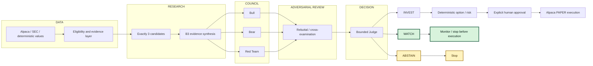

# AI Investment Council Architecture

The completed competition path is highlighted: the evidence-complete Judge selected **WATCH**, so the system stopped before B5 and before any broker side effect.

`WATCH` is a valid decision outcome, not a failed execution. It keeps the execution boundary closed when the frozen policy cannot prove positive executable INVEST authority.
